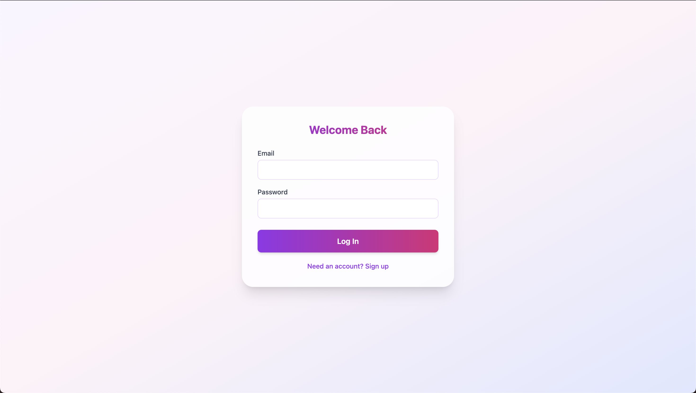
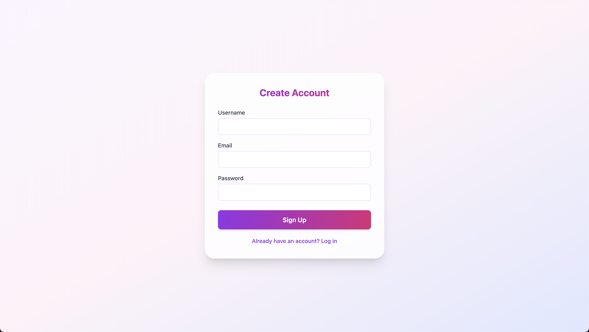
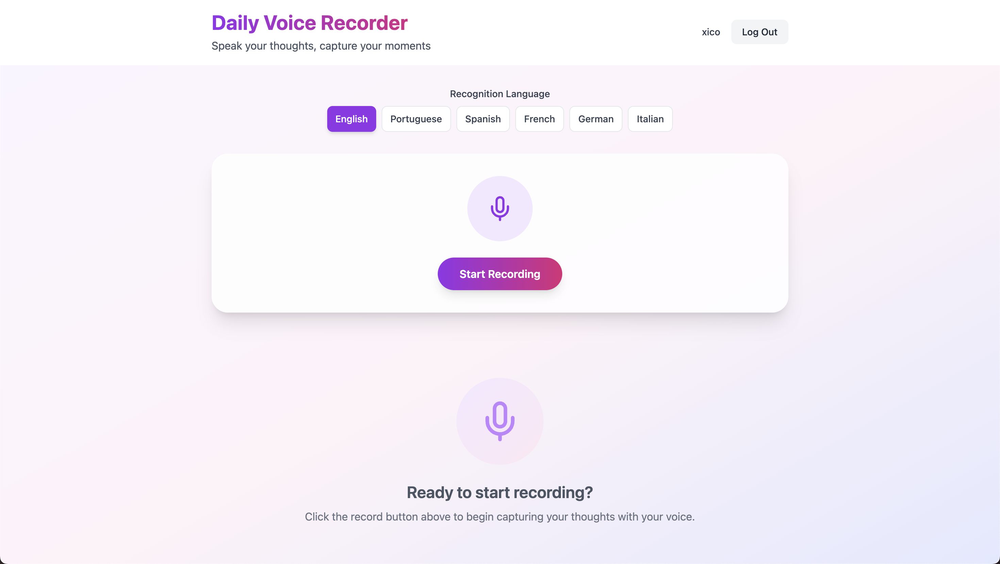
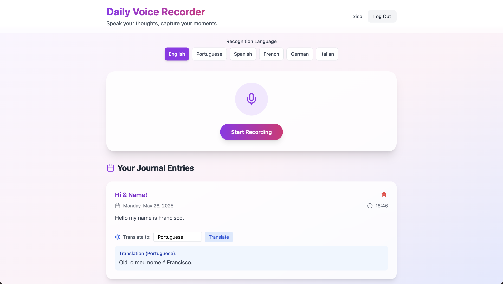

# Daily Voice Recorder

A modern web application that enables users to record their thoughts through voice, automatically transcribes them, and allows translation into multiple languages.

## Features

- 🎤 **Voice Recording & Transcription** - Capture your thoughts using speech-to-text technology
- 🔄 **Real-time Translation** - Translate your entries into multiple languages
- 🔒 **Secure Authentication** - Email verification for enhanced security
- 👤 **User Profiles** - Personalized experience with custom usernames
- 📱 **Responsive Design** - Works on desktop and mobile devices
- 🔍 **Search & Filter** - Easily find past entries
- 🌙 **Multi-language Support** - Record in different languages

## Design

### Sign In

*Secure login with email verification*

### Sign Up

*Create an account with username and email verification*

### Home Dashboard

*Clean interface for recording and viewing entries*

### Transcription & Translation

*Recorded entry with translation capabilities*

## Technologies Used

- **Frontend**: React.js with Tailwind CSS
- **Backend**: Firebase (Authentication, Firestore)
- **Speech Recognition**: Web Speech API
- **Translation**: MyMemory Translation API

## Getting Started

### Prerequisites
- Node.js (v14 or higher)
- npm (v6 or higher)
- Firebase account

### Installation

1. Clone the repository:
```bash
git clone https://github.com/xicoooooo/daily-voice-recorder.git
cd daily-voice-recorder
```

2. Install dependencies:
```bash
npm install
npm start
```

3. Build for production:
```bash
npm run build
```

## Environment Setup

This project requires Firebase configuration. Before running the app:

1. Create a `.env` in the root directory with the following variables in [`.env.example` file](.env.example).
2. Replace the placeholder values with your Firebase project credentials from the Firebase console.

## Deployment

The application is deployed on Vercel and can be accessed at [daily-voice-recorder.vercel.app](https://daily-voice-recorder.vercel.app/)

### Deploy your own instance:

1. Fork this repository
2. Connect your Vercel account to your GitHub repository
3. Configure environment variables in Vercel:
```bash
REACT_APP_FIREBASE_API_KEY=your-api-key
REACT_APP_FIREBASE_AUTH_DOMAIN=your-auth-domain
REACT_APP_FIREBASE_PROJECT_ID=your-project-id
REACT_APP_FIREBASE_STORAGE_BUCKET=your-storage-bucket
REACT_APP_FIREBASE_MESSAGING_SENDER_ID=your-messaging-sender-id
REACT_APP_FIREBASE_APP_ID=your-app-id
REACT_APP_FIREBASE_MEASUREMENT_ID=your-measurement-id
```

4. Deploy!

## How It Works

1. **Sign up/Sign in** - Create an account with email verification.
2. **Record your voice** - Click the microphone button and start speaking.
3. **Review and save** - The app transcribes your speech in real-time.
4. **Translate** - Select from multiple languages to translate your entries.
5. **Access anywhere** - Your entries are securely stored in the cloud.
6. **Manage entries** - Edit, delete, paginate, and browse your journal history. 
7. **Translate** - Translate any entry into another language without altering the original.

## Privacy & Security

- All user data is stored in Firebase Firestore with secure rules.
- Authentication requires email verification.
- Entries are only accessible to the user who created them.
- No third-party has access to your entries content.
- Translations are performed only when explicitly requested.


## Pull Requests

Please feel free to submit a Pull Request.

1. Fork the repository
2. Create your feature branch (`git checkout -b feature/amazing-feature`)
3. Commit your changes (`git commit -m 'Add some a-feature'`)
4. Push to the branch (`git push origin feature/a-feature`)
5. Open a Pull Request

## Acknowledgments

- React.js team for the amazing framework
- Firebase for the powerful backend services
- Web Speech API for speech recognition capabilities
- MyMemory for translation services